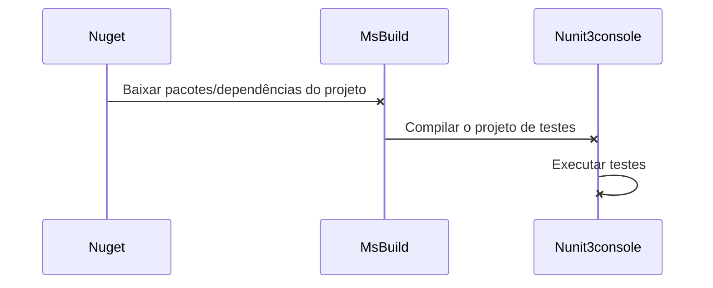
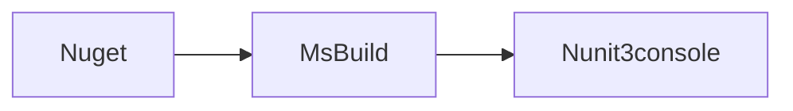

# AutomacaoMantisBase2
  
Projeto de automação de testes em C# para testes de interface Web e testes funcionais de API.

Esta explicação do projeto tem como base a explicação do projeto do @saymowan, que foi muito bem executado.

## Metas deste projeto:

## Projeto Web
 
-  **1. Preparação do ambiente:** utilizar Mantis para execução de automação de testes;

-  **2. 50 Scripts:** Implementar 50 scripts de testes que manipulem uma aplicação web Mantis utilizando PageObjects.

-  **3. Data Driven Testing:** Alguns scripts devem ler dados de uma planilha Excel para implementar Data-Driven.

-  **4. Selenium Grid:** Os casos de testes precisam ser executados em no mínimo três navegadores. Utilizando o Selenium Grid e um arquivo de configuração que determina o navegador que será usado.

-  **5. Screenshots:** Gravar screenshots ou vídeo automaticamente dos casos de testes.

-  **6. Report de execução:** O projeto deverá gerar um relatório de testes automaticamente com screenshots ou vídeos embutidos. Sugestões: Allure Report ou ExtentReport.

-  **7. Conexão banco de dados:** A massa de testes deve ser preparada neste projeto, seja com scripts carregando massa nova no BD ou com restore de banco de dados.

-  **8. Javascript em uso:** Um dos scripts deve injetar Javascript para executar alguma operação na tela. O objetivo aqui é exercitar a injeção de Javascript dentro do código do Selenium.

-  **9. Integração Contínua:** Testes deverão ser agendados pelo Jenkins, CircleCI, TFS ou outra ferramenta de CI que preferir.

  
  

# 1. Preparação do ambiente Mantis

  

Serão necessárias as seguinte configurações para iniciar o projeto:

**Docker-compose:**  no projeto, é possível encontrar um arquivo chamado "docker-compose.yml", este arquivo tem as devidas configurações da aplicação que foi automatizada, seu banco de dados e o framework de execução remota de testes automatizados. Cole o mesmo no diretório C:\mantis:

**1.1 Preparação Mantis + MariaDB**
1.  Instalar [Docker Toolbox](https://docs.docker.com/toolbox/toolbox_install_windows/)

2. Executar o software *Docker Quickstart Terminal*

3. Acessar o diretório "C:/mantis" através do terminal aberto no passo anterior

4. No diretório haverá o arquivo **docker-compose.yml**

5. Executar o comando> `docker-compose.exe up -d`

6. Após o processamento, para validar execute o comando `docker ps -a` e os contêineres estarão disponíveis.

**1.2 Configuração máquina remota**

1. Com o tópico 1.1 já realizado, executar no *Docker Quickstart Terminal*, o comando `docker-machine ip` e coletar a informação

2. Abrir o software VirtualBox (última versão deverá estar instalada)

3. Encontrar a imagem referente ao docker

4. Acessar "Configurações"

5. Acessar "Redes"

6. Acessar "Avançado"

7. Acessar "Redirecionamento de Portas"

8. A configuração para funcionar no docker toolbox deverá estar dessa maneira:

9. Incluir linha conforme nome "docker"

10. Protocolo: TCP

11. Endereço de Hospedeiro: 127.0.0.1

12. Porta de Hospedeiro: 80

13. IP Convidado preenchido com o valor recebido do docker (docker-machine ip default): 192.168.99.100

14. Porta do convidado: 80

O ambiente Mantis deverá estar disponível em: http://192.168.99.100:8989

**1.3 Configuração inicial Mantis**

Para o primeiro acesso ao Mantis, será necessário configurar o banco de dados conforme tabela abaixo:

| Variável | Valor |
|-----|------|
| Type of Database | MySQL Improved |
| Hostname (for Database Server) | mantis_db_1 |
| Username (for Database) | mantisbt |
| Password (for Database) | mantisbt |
| Database name (for Database) | bugtracker |
| Admin Username (to create Database if required) | root |
| Admin Password (to create Database if required) | root |

  

Após preencher, clicar em **Login/Continue** e aguardar o processamento (demora cerca de 5 minutos).

O primeiro acesso deverá ser feito utilizando as credenciais *administrator/root*. Redefinir a senha para o valor *administrator*.

**1.4 Configuração inicial MariaDB**

Abrir o software VirtualBox:

1. Encontrar a imagem referente ao docker

2. Acessar "Configurações"

3. Acessar "Redes"

4. Acessar "Avançado"

5. Acessar "Redirecionamento de Portas"

6. A configuração para funcionar no docker toolbox deverá estar dessa maneira:

7. Incluir linha conforme nome "docker"

8. Protocolo: TCP

9. Endereço de Hospedeiro: 127.0.0.1

10. Porta de Hospedeiro: 3306

11. IP Convidado preenchido com o valor recebido do docker (docker-machine ip default): 192.168.99.100

12. Porta do convidado: 3306

Para acessar o banco de dados, utilize algum SGBD MySQL (exemplo: Heidi SQL) com as credenciais listadas acima.

## 2. 50 Scripts

Foram criados 50 scripts de testes funcionais para validar as funcionalidades presentes no sistema Mantis, que podem ser vistas nas classes:
  
- CriarTarefasTestes

- GerenciarTestes

- HomeTestes

- LoginTestes

- VerTarefasTestes

## 3. Data Driven Testing

Foi implementado um testes para a exemplificação do uso do recurso DataDriven Testing (DDT). 
É possível verificar ao acessar a classe `CriarTarefasTests.cs` com o método `criarTarefasDDT`.
  

## 4. Selenium Grid

Para a execução remota dos testes automatizados, via selenum grid, serão utilizados os seguintes passos:

- Configuração dos contêineres hub, node chrome e node mozilla

- Verificação do console

- Configurações do projeto para execução: Local ou Remota

- Configurações do projeto para execução em um nó

**4.1 Configuração dos contêineres hub, node chrome e node mozilla**

- Executar o software *Docker Quickstart Terminal*

- Após o processamento, para validar execute o comando `docker ps -a` e os contêineres estarão disponíveis:

- selenium/node-firefox

- selenium/node-chrome

- selenium/hub

**4.2 Verificação do console**

Após o processamento, as seguintes imagens estarão disponíveis em execução:

Faça a configuração de porta no *VirtualBox* conforme passos anteriores informados:

Ao executar o comando no navegador `http://192.168.99.100:4444/grid/console` também é possível verificar o console rodando corretamente com seus nós:

Quanto browser :P

**4.3 Configurações do projeto para execução: Local ou Remota**

Para a execução local ou via docker, foi criada uma variável no App.Config chamada de `<add key="Local" value="false"/>`. Muito intuitiva.

- Caso seja remota, colocar o valor `true` e configurar corretamente o selenium hub e nós.

- Caso seja local, iremos sempre utilizar o Google Chrome, para isso coloque o valor `false` e coloque um binário do chrome driver no diretório `C:\Drivers` com o nome "*chromedriver*". Exemplo:

**4.4 Configurações do projeto para execução em um navegador remoto**

Para a execução remota em um determinado nó (chrome ou mozilla), configure os seguintes parâmetros no App.config, o hub deverá estar rodando com os nós.

- Variável: `<add key="Local" value="true"/>`

- Variável que indica o navegador (chrome ou firefox): `<add key="NavegadorDefault" value="chrome"/>`

As configurações de tamanho, dimensionamento e outros argumentos por browser estão na classe `Browser.cs`.

## 5. Screenshots

Para o recurso de *screenshots* dos resultados positivos ou negativos de cada teste, foi criada uma lógica para ao finalizar a execução do teste, faça a inclusão de uma evidência para a apuração. Juntamente com o framework [ExtentReports](http://extentreports.com).

Executado na `Relatorio.cs`

## 6. Report de execução

Para o report de execução de testes foi utilizado um framework [ExtentReports](http://extentreports.com). 
Uma classe Relatorio.cs gerencia as ações que são chamadas na camada PageObjects e também na Uteis.

O relatório sempre será gerado na pasta raiz do projeto `\bin\debug\Reports` com o nome `_Desafio Automação Fernando Ferreira_(dataDeExecucao).html`. Caso o diretório não exista, ele criará, fique tranquilo(a) !! (=

## 7. Conexão banco de dados:

Utilizado conexão com o MySQLConnection e criado método que inicializa o banco de dados com os dados necessários para execução de qualquer um dos testes.

`public static void InicializarTestes()`

## 8. Javascript em uso:
  

Uma forma de manipular informações via interface é utilizando métodos javascript, para isso fiz um método de inserção dos dados de login via JavaScript.

## 9. Integração Contínua:

A integração contínua é um processo automatizado de disponibilização de versões novas após um checkin no repositório remoto (bitbucket, gitlab, github), neste processo estão incluídos atividades de:

- Baixar a nova versão do projeto

- Restore de pacotes

- Restore de dependências

- Construção do projeto (build)

- Execução de testes automatizados (UI, API ou UNIT)

- Deploy em ambiente controlado

- Etc

Para o processo deste projeto, iremos realizar as seguintes atividades para o projeto de automação de testes:

- Baixar a nova versão do projeto

- Restore de pacotes

- Restore de dependências

- Construção do projeto (build)

- Execução de testes automatizados (UI)

Abaixo um fluxo das atividades para facilitar o entendimento:

A execução sequêncial será desta forma:

**9.1 Softwares do processo de compilação e execução de testes**

Os passos da integração contínua para a linguagem deste projeto demandam os seguintes software instalados:

-  [Nuget](https://www.nuget.org/downloads) - Colocar no seguinte diretório: "C:\\Program Files (x86)\\NuGet\\nuget.exe"

-  [MsBuild](https://www.microsoft.com/en-us/download/details.aspx?id=48159) - Instalar no diretório default do instalador.

-  [Nunit3-console](http://nunit.org/download/) - Instalar no diretório default do instalador.

**9.2 Ferramenta de Integração Contínua - Azure DevOps**

Para a execução dos testes automatizados deste projeto ser feita de maneira automática ou agendada, foi utilizado o software Azure DevOps.

Consideraremos que para execução dos testes o servidor utilizado já possua instanciado a aplicação do mantis conforme configurado no passo 1 deste tutorial.
  
Dentro da ferramenta, podemos criar o pipeline através de um YAML ou de forma manual, o que será demonstrado abaixo:

- New Build Pipeline - para criação de um novo pipeline;
- Use the classic editor;
- Select a source - GitHub - inserido o repositório do projeto criado e qual a branch que será utilizada para execução do pipeline

- Select a template - escolher iniciar com `Empty job`

Perceba que será criado um pipeline com um Agent Job 1 mas ainda sem nenhuma ação determinada. Sendo assim, configuraremos nossas ações dentro deste job. Devem ser incluídas as ações abaixo:

- Nuget Restore - Responsável por restaurar os pacotes do NuGet utilizados no projeto

- Visual Studio Build - irá executar o build do projeto e a criação das DLL's que serão executadas.

- Visual Studio Test - basta informar as DLL's que deseja executar, o próprio sistema irá executar os testes conforme os critérios informados.

- Publish Build Artifacts - Armazena os relatórios gerados dentro do build executado.

É possível configurar o pipeline para que seja executado periodicamente na aba Triggers:

  Onde também é possível configurar a execução do pipeline todas as vezes que for incluída alguma alteração no projeto:
  

Assim está configurado a execução de pipeline de integração contínua no Azure DevOps.
A ferramenta ainda permite que seja gerado as instruções YAML, clicando na opção `View YAML`

Assim está finalizado o fluxo de todas as atividades propostas no início deste projeto. 
Faça as devidas referências caso utilize este projeto.

Dúvidas estou à disposição. Valeu! 
